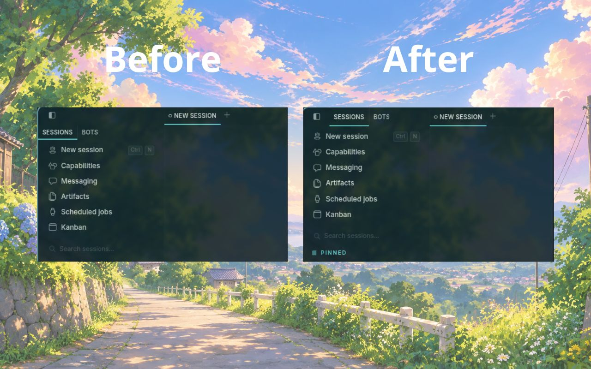

# Inline Sidebar Tabs for Hermes Agent

A compact layout plugin for Hermes Desktop that keeps your **Sessions** and **Bots** tabs on the same row as the **Hide sidebar** button — reclaiming the vertical space Hermes currently wastes on a second titlebar row.



## What you get

- **Less wasted space.** The tab strip sits beside the sidebar toggle instead of below it, giving your sidebar more room.
- **Fully automatic.** The plugin detects available space and only applies the compact layout when it fits. Narrow sidebars keep Hermes' native two-row layout.
- **Zero configuration.** Install, reload, and forget.

## Installation

1. Copy the `inline-sidebar-tabs` folder so that `plugin.js` ends up at:

   ```
   ~/.hermes/desktop-plugins/inline-sidebar-tabs/plugin.js
   ```

2. In Hermes Desktop, run **Reload desktop plugins** (or restart the app).

That's it. The plugin activates immediately.

## Disabling

Disable **Inline Sidebar Tabs** from Hermes' Plugins panel, or delete the folder:

```
~/.hermes/desktop-plugins/inline-sidebar-tabs/
```

Reload plugins and Hermes returns to its default layout.

## Requirements

- Hermes Desktop (built against the October 2026 layout).

## A small way to support the project

If you are considering the Nous Portal **Plus** plan, you can use [my Nous Portal referral link](https://portal.nousresearch.com/r/mykeura). Your first month costs **$5 instead of $20**, and I receive a $10 referral credit that helps cover the API usage behind my ongoing work on Inline Sidebar Tabs and related Hermes plugins. It is entirely optional, but it is a simple way for both of us to benefit.

The offer is for new customers starting a new Plus subscription. It applies to the first invoice, and each payment card can be used for only one referral. If the card has already backed another referral, the discount is reversed and no referral reward is paid.

If you would rather support my work directly, you can also [sponsor me on GitHub](https://github.com/sponsors/mykeura). Every bit helps me keep building and maintaining these open-source plugins. Thank you!

## License

[MIT](LICENSE)
